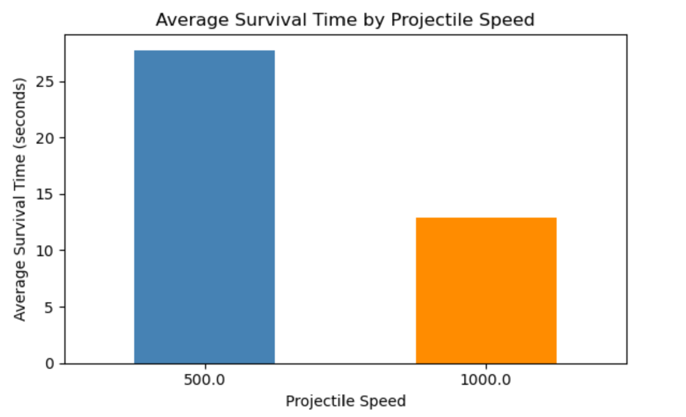
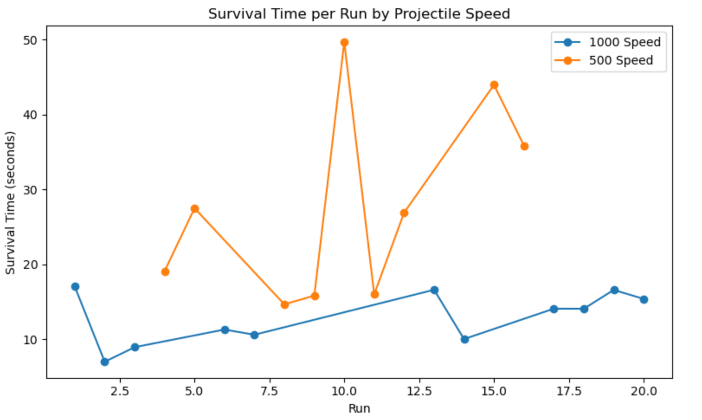

# Experimental Design - DC
### Research Design
We are trying to find out if decreasing projectile speed balances the game in the right direction, or if this makes the game far too easy.

###  Variables
Our independent variable is the projectile speed. Our dependent variable is the survival time.

### Hypothesis

If we change the projectile speed, then surival time will increase, because the player requires less reaction time, and cannot fall victim to bad RNG (projectiles spawning very close to the player).

### Results

The result was that on average, decreasing the projectile speed to 500 resulted in a survival time 2.4 times greater than that of a projectile with speed of 1000. This confirms our my hypothesis. We avoided bias by having the game coin flip between the two speeds while testing.

Based on the data, we chose to use a speed of 500 for the game, as this feels more contingent on player skill, and has more varied data.